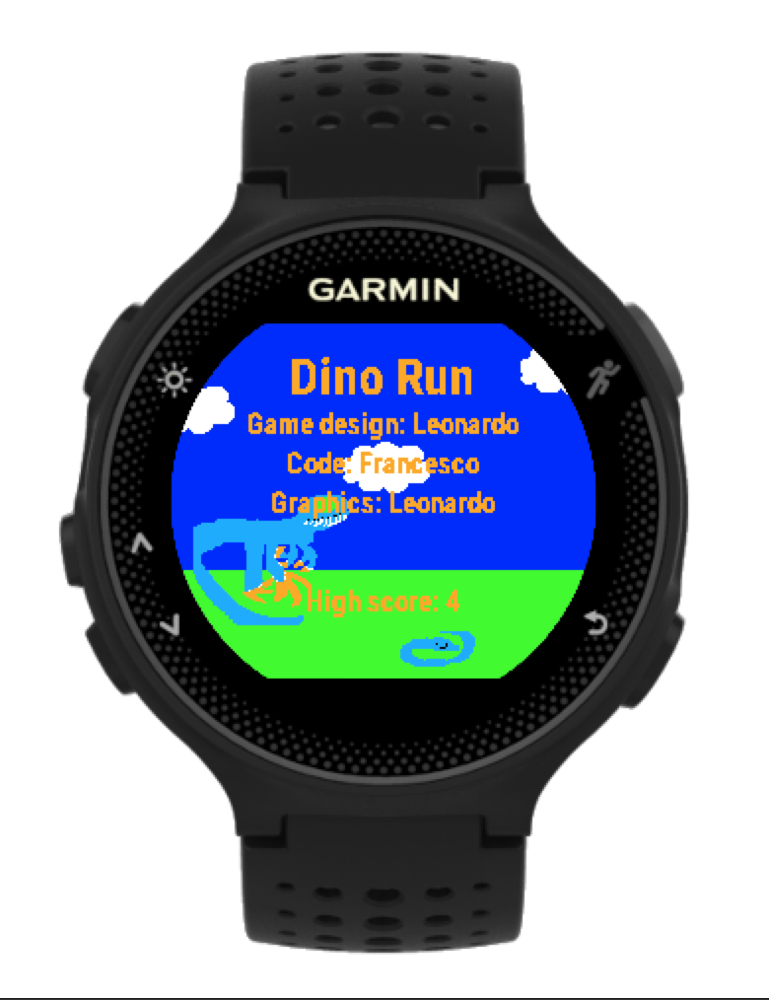

This is a simple game for the Garmin Forerunner that I made with my son.

It was developed and tested with Garmin Connect IQ 4.2.3 SDK and VS Code.

## How to build

* Download and install VS Code
* Download and install the Garmin Connect IQ SDK
* Install the VS Code plugin
* Open the project in VS Code
* Build and run in simulator
* To build for device, select the command "Monkey C: build for device" from the command list, and copy the .prg file to the APPS folder in the watch.

## Testing

To show the bounding boxes change the value of const SHOW_BOUNDING_BOXES to true in source/constants.mc, and rebuild.

## Acknowledgments

Thanks to Jakub Tkadleček for making his [Flappy Bird](https://github.com/Tkadla-GSG/garmin) code available, which I took as a starting point.

Sprites were edited in [Piskel](https://www.piskelapp.com)

And thanks to [Github Copilot](https://github.com/features/copilot) for being a great programming buddy!
